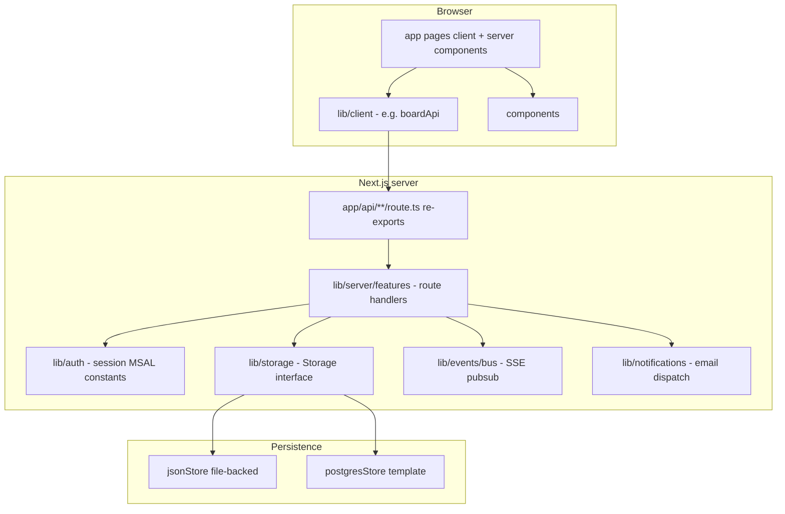

# Architecture

## Product shape

Next.js 14 **App Router** application: authenticated Microsoft users (or demo mode) manage **projects**, **subitems**, **files**, and **notification** preferences. The main surface is a board-style UI with dashboard, timeline, documents, team, and settings areas.

## Layered layout

- **`app/`** — Routing only for pages; **`app/api/*/route.ts`** files stay minimal so Next.js segment config (for example `dynamic`, `runtime`) remains next to the URL. They re-export handlers from **`lib/server/features/`**.
- **`lib/server/`** — Server-only helpers: **`routeAuth.ts`** (`authenticateRequest`) and **`routes/*`** — the real request/response logic for each API segment.
- **`lib/client/`** — Browser-only modules (for example **`boardApi.ts`**) that call `/api/*` or the in-memory demo store.
- **`lib/storage/`** — Single **`Storage`** interface; **`STORAGE_DRIVER`** selects JSON or Postgres adapter.
- **`lib/db/`** — Drizzle schema and SQL migrations aligned with the JSON document shape.
- **`lib/events/bus.ts`** — In-process publish/subscribe used by **`/api/events`** (Server-Sent Events). Comment in source notes multi-instance limitations.

## Authentication and access control

- **`middleware.ts`** — When `NEXT_PUBLIC_DEMO_MODE` is not truthy `"true"`, unauthenticated requests to non-public paths receive a redirect to `/login` (pages) or `401` JSON (API). Public paths include login, Microsoft login, verify-session, and cron.
- **`lib/auth/session.ts`** — Reads the session cookie, resolves the user via **`storage`**, exposes **`getCurrentUser`** and **`requireUser`** (throws a `Response` with JSON body on failure).
- **`lib/server/routeAuth.ts`** — **`authenticateRequest()`** wraps `requireUser().catch((r) => r)` so API handlers consistently get `User | Response` without repeating the pattern.

## Real-time updates

Server handlers call **`bus.publish(...)`** after mutations. Clients open an SSE stream to **`GET /api/events`**, which subscribes to the bus and forwards typed events. This keeps the UI in sync after project/subitem/file changes when not in isolated demo mode.

## Extension guidelines

1. **New REST capability** — Add a module under **`lib/server/features/<area>/`**, then add or extend **`app/api/.../route.ts`** to export the HTTP methods (and any route segment config). Keeps handlers testable and avoids bloating `app/api` with business logic.
2. **New persisted fields** — Update **`lib/types/`**, **`lib/db/schema.ts`**, migrations under **`lib/db/migrations/`**, and both **`jsonStore`** and (when ready) **`postgresStore`** implementations.
3. **New UI that talks to the API** — Prefer **`lib/client/`** for fetch wrappers so components stay presentational.
4. **Background jobs** — Follow **`/api/cron/due-dates`**: shared secret header, logic in **`lib/server/features/cron/`**, thin `app/api` export.
